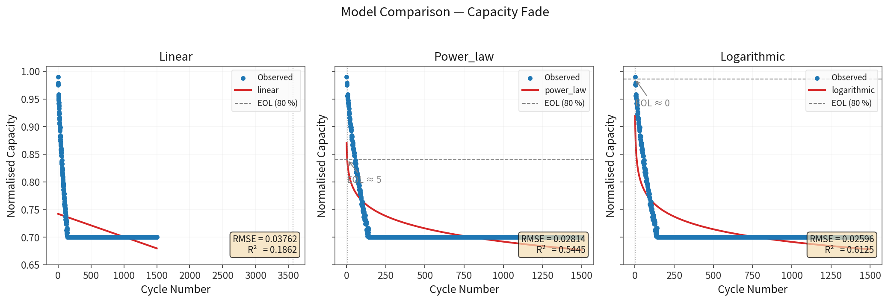

# Battery Cycle‑Life Analyzer (bcla)

[](https://python.org)
[](LICENSE)
[](https://github.com/psf/black)
[](https://colab.research.google.com/github/mohammadrezwankhan/battery-cycle-life-analyzer/blob/main/notebooks/demo.ipynb)

**Fit degradation models to battery cycling data, project remaining useful
life, and generate publication‑ready figures — in under 20 lines of Python.**

Designed for battery researchers, energy‑storage engineers, and students who
need a quick, transparent estimate of cycle‑life without running complex
physics simulations.

---

## Quick start

```bash
pip install -e .
python -m bcla --model all          # fit + plot synthetic LFP data
pytest tests/ -v                     # run unit tests
```

Or open [`notebooks/demo.ipynb`](notebooks/demo.ipynb) for an interactive walk‑through.

---

## Features

| Feature | Description |
|---------|-------------|
| **Degradation models** | Linear, power‑law (LFP‑style), logarithmic — all with scipy curve_fit |
| **Automatic best‑fit** | `bcla.core.best_model()` picks the lowest‑RMSE model |
| **EOL projection** | `FitResult.eol_cycle()` estimates when capacity hits any threshold |
| **Temperature acceleration** | Arrhenius‑based `acceleration_factor()` to compare operating temperatures |
| **Publication plots** | Matplotlib figures with ready‑to‑save PNG output at 150+ DPI |
| **Built‑in datasets** | Synthetic LFP and NMC cycling data for instant demo |
| **CLI + Python API** | Use from the terminal or import as a library |

---

## Example

```python
from bcla import core, viz, datasets

# 1. Load data
cycles, capacity = datasets.synthetic_lfp(cycles=1500)

# 2. Fit all models
results = core.fit_all_models(cycles, capacity)
name, best = core.best_model(results)                # picks lowest RMSE

# 3. Project end‑of‑life
eol = best.eol_cycle(eol_fraction=0.8)
print(f"Best model: {name} | EOL ≈ {eol:.0f} cycles")

# 4. Plot
fig = viz.model_comparison(results)
fig.savefig("capacity_fade.png", dpi=150, bbox_inches="tight")
```



---

## Project structure

```
battery-cycle-life-analyzer/
├── bcla/                    # Python library
│   ├── __init__.py
│   ├── core.py              # Degradation models & curve fitting
│   ├── viz.py               # Matplotlib plotting helpers
│   ├── datasets.py          # Synthetic data generators
│   └── __main__.py          # CLI entry point
├── notebooks/
│   └── demo.ipynb           # Interactive Jupyter demo
├── tests/
│   └── test_core.py         # Pytest unit tests
├── pyproject.toml
├── setup.py
├── Makefile
└── README.md
```

---

## When to use this vs. PyBaMM

| Tool | Best for |
|------|----------|
| **bcla** (this) | Quick capacity‑fade curve‑fitting from cycling test data; EOL estimates; temperature‑sensitivity studies |
| [PyBaMM](https://github.com/pybamm-team/PyBaMM) | Full physics‑based electrochemical battery simulation (DFN, SPMe, etc.) |

bcla is **complementary** — fit a model to PyBaMM output data, or use it standalone for lab‑test data.

---

## Citation

If you use this in published work, please cite the repository:

```bibtex
@software{khan2026bcla,
  author = {Mohammad Rezwan Khan},
  title = {Battery Cycle-Life Analyzer},
  year = {2026},
  url = {https://github.com/mohammadrezwankhan/battery-cycle-life-analyzer}
}
```

---

## License

[MIT](LICENSE)
