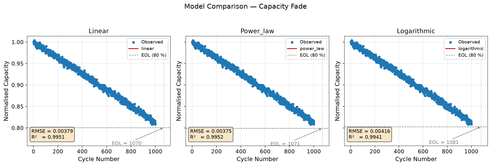

# Battery Cycle-Life Analyzer

Fit transparent empirical capacity-fade models, compare diagnostics, and
project battery end of life inside an explicit extrapolation limit.

[View the source and documentation](https://github.com/mohammadrezwankhan/battery-cycle-life-analyzer)
|
[Open the Colab notebook](https://colab.research.google.com/github/mohammadrezwankhan/battery-cycle-life-analyzer/blob/main/notebooks/demo.ipynb)



## What it provides

- Linear, power-law, and logarithmic capacity-fade fits using SciPy.
- RMSE and R^2 diagnostics for every fitted model.
- Chronological late-cycle validation for model selection before a full-data refit.
- A configurable EOL threshold relative to fitted initial capacity.
- Residual-bootstrap EOL/RUL intervals with explicit censoring and fit-failure counts.
- A bounded projection horizon that returns no estimate when EOL is outside
  three times the largest observed cycle.
- Reproducible synthetic LFP and NMC demonstrations.
- CSV/TSV cycle-capacity import with normalization and validation.
- Optional long-form ingestion with metadata columns for reproducibility and
  provenance, plus optional duty-cycle history v2 for interval-level operating
  context.
- Publication-ready Matplotlib figures and a tested Python API.

## Quick start

```bash
git clone https://github.com/mohammadrezwankhan/battery-cycle-life-analyzer.git
cd battery-cycle-life-analyzer
python -m pip install .
python -m bcla --model all
```

## Model families

For normalized capacity `Q(n)` at cycle `n`:

- Linear: `Q(n) = Q0 - k n`
- Power law: `Q(n) = Q0 - alpha n^beta`
- Logarithmic: `Q(n) = Q0 - a ln(1 + b n)`

The default multi-model workflow selects the model with the lowest RMSE on the
latest chronological holdout, then refits that family on all observations.
The validation fraction counts observation rows; repeated cycle indices are
kept together and therefore cannot straddle the chronological split.
Lowest training RMSE remains available only as an explicit in-sample
diagnostic. Unsupported threshold crossings return no estimate, and bootstrap
intervals are withheld whenever a replicate falls outside the bounded
projection horizon or fails to fit.

## Scope and limitations

This is an empirical research and educational baseline, not an
electrochemical, pack-safety, or production BMS model. The bundled data are
synthetic. Engineering conclusions require representative laboratory data and
explicit consideration of chemistry, protocol, temperature, time metadata, and
uncertainty. The residual bootstrap is conditional on the selected empirical
model and assumes exchangeable, constant-variance residuals. It does not cover
model-form error, protocol shifts, serial or cycle-dependent residual structure,
or unrecorded measurement uncertainty.

## Project links

- [README and equations](https://github.com/mohammadrezwankhan/battery-cycle-life-analyzer#readme)
- [Contributing guide](https://github.com/mohammadrezwankhan/battery-cycle-life-analyzer/blob/main/CONTRIBUTING.md)
- [MIT license](https://github.com/mohammadrezwankhan/battery-cycle-life-analyzer/blob/main/LICENSE)
